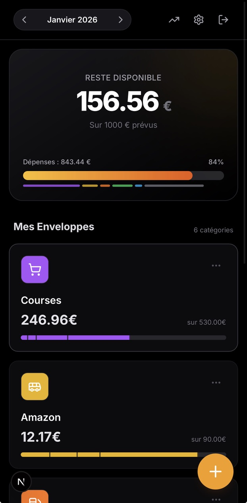
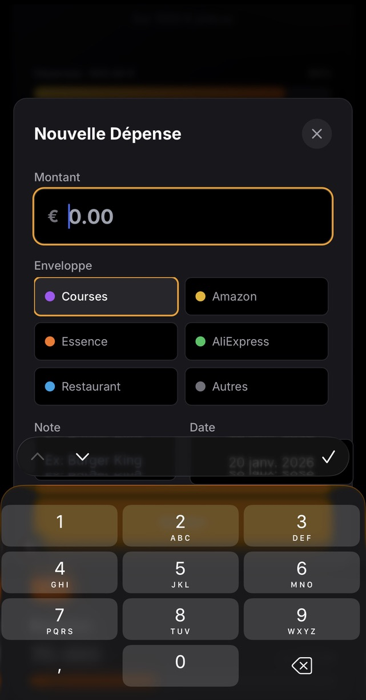
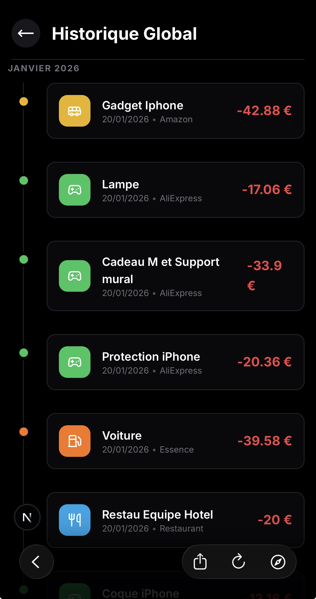
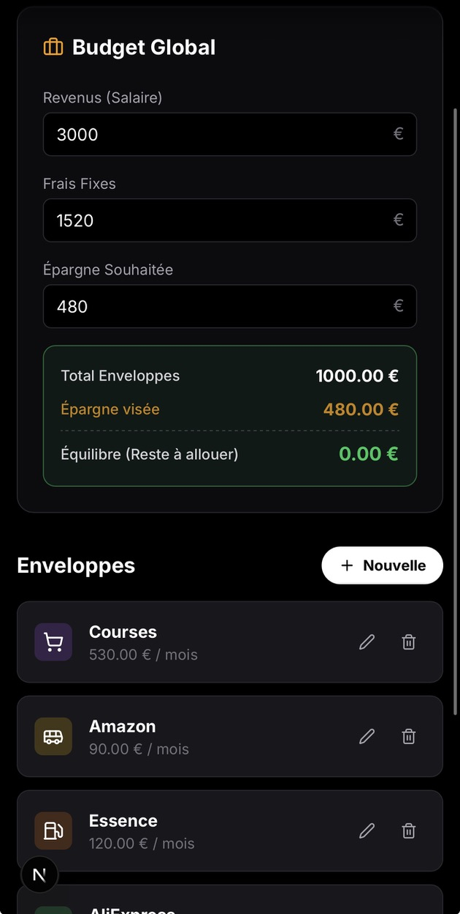

# 💸 BudgetFlow

> Maîtrisez votre budget mensuel grâce à la méthode des enveloppes. Simple, visuel et efficace.

**BudgetFlow** est une application web moderne conçue pour vous aider à reprendre le contrôle de vos finances personnelles. Basée sur la célèbre **méthode des enveloppes virtuelles**, elle vous permet d'allouer un budget précis à chaque catégorie de dépense et de suivre votre consommation en temps réel, sans frustration.

## ✨ Fonctionnalités Clés

- **🎯 Gestion par Enveloppes** : Créez des catégories personnalisées (Courses, Loisirs, Shopping, etc.) et allouez-y un budget mensuel.
- **📊 Dashboard Visuel** :
  - Vue d'ensemble du *Reste à Vivre*.
  - Barres de progression détaillées pour chaque enveloppe.
  - Segmentation visuelle des dépenses sur la barre de progression.
- **📱 Mobile First** :
  - Interface pensée pour l'usage quotidien sur smartphone.
  - Claviers numériques adaptés (iOS/Android) pour une saisie ultra-rapide.
  - Actions rapides ("Nouvelle Dépense") accessibles en un clic.
- **📅 Historique & Suivi** :
  - Historique global des transactions avec séparation mensuelle.
  - Vue détaillée par enveloppe.
- **⚙️ Configuration Complète** :
  - Gestion des revenus (Salaire).
  - Déduction automatique des charges fixes et de l'épargne cible.
  - Indicateurs d'équilibre budgétaire.
- **🔒 Sécurité** : Authentification robuste et stockage Cloud via Firebase.

## � Aperçu de l'interface

<p align="center">
  
  
  
  
</p>

## �🛠 Stack Technique

Ce projet utilise les dernières technologies du développement web modrene :

- **Framework** : [Next.js 14](https://nextjs.org/) (App Router)
- **Langage** : [TypeScript](https://www.typescriptlang.org/)
- **Styles** : [Tailwind CSS](https://tailwindcss.com/)
- **Backend as a Service** : [Firebase](https://firebase.google.com/)
  - **Authentication** : Email/Password & Google Auth.
  - **Firestore** : Base de données NoSQL temps réel.
- **Icônes** : [Lucide React](https://lucide.dev/)

## 🚀 Installation & Démarrage

### Prérequis

- Node.js (v18 ou supérieur)
- Un projet Firebase configuré (avec Auth et Firestore activés)

### 1. Cloner le projet

```bash
git clone https://github.com/votre-username/budget-flow.git
cd budget-flow
```

### 2. Installer les dépendances

```bash
npm install
# ou
yarn install
```

### 3. Configuration des variables d'environnement

Créez un fichier `.env.local` à la racine du projet en copiant l'exemple :

```bash
cp .env.example .env.local
```

Remplissez ensuite les valeurs avec vos identifiants Firebase (disponibles dans la console Firebase > Project Settings) :

```env
NEXT_PUBLIC_FIREBASE_API_KEY=votre_api_key
NEXT_PUBLIC_FIREBASE_AUTH_DOMAIN=votre_project.firebaseapp.com
NEXT_PUBLIC_FIREBASE_PROJECT_ID=votre_project_id
NEXT_PUBLIC_FIREBASE_STORAGE_BUCKET=votre_project.appspot.com
NEXT_PUBLIC_FIREBASE_MESSAGING_SENDER_ID=votre_sender_id
NEXT_PUBLIC_FIREBASE_APP_ID=votre_app_id
```

### 4. Lancer le serveur de développement

```bash
npm run dev
```

L'application sera accessible sur `http://localhost:3000`.

## 📂 Structure du Projet

```
src/
├── app/                 # Pages et Routing (Next.js App Router)
│   ├── (auth)/          # Pages publiques (Login)
│   ├── (protected)/     # Pages protégées (Dashboard, Onboarding, etc.)
│   └── layout.tsx       # Layout racine et Providers
├── components/          # Composants UI réutilisables
│   └── dashboard/       # Composants spécifiques au dashboard
├── context/             # Contextes React (ex: AuthContext)
├── lib/                 # Configuration Firebase et utilitaires
└── ...
```

## 🤝 Contribuer

Les contributions sont les bienvenues !
1.  Forkez le projet.
2.  Créez votre branche de fonctionnalité (`git checkout -b feature/AmazingFeature`).
3.  Commitez vos changements (`git commit -m 'Add some AmazingFeature'`).
4.  Push vers la branche (`git push origin feature/AmazingFeature`).
5.  Ouvrez une Pull Request.

## 📄 Licence

Distribué sous la licence MIT. Voir `LICENSE` pour plus d'informations.