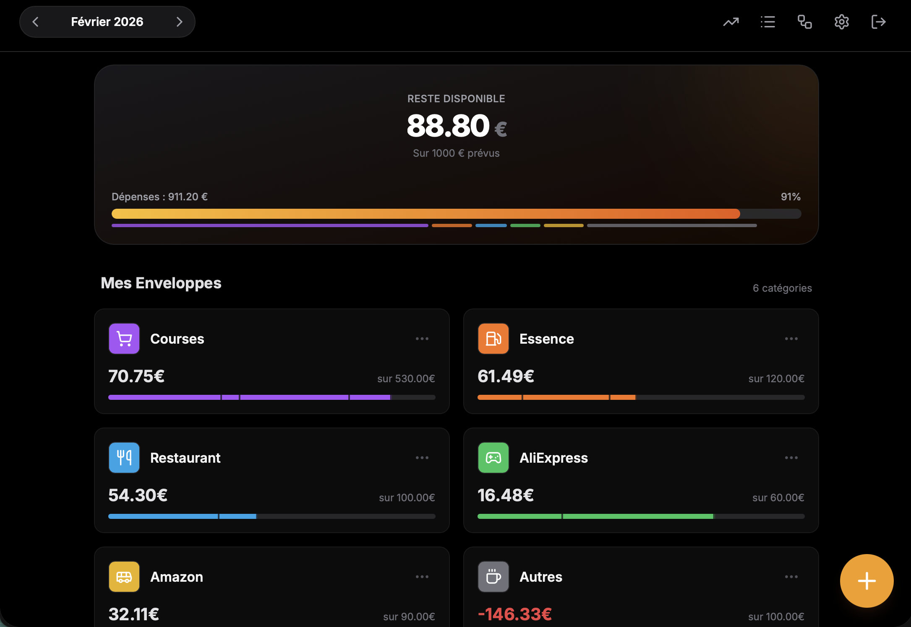

# BudgetFlow

> Maîtrisez votre budget mensuel grâce à la méthode des enveloppes. Simple, visuel et efficace.

**BudgetFlow** est une application web moderne conçue pour vous aider à reprendre le contrôle de vos finances personnelles. Basée sur la célèbre **méthode des enveloppes virtuelles**, elle vous permet d'allouer un budget précis à chaque catégorie de dépense et de suivre votre consommation en temps réel, sans frustration.

## Fonctionnalités:

- **Gestion par Enveloppes** : Créez des catégories personnalisées (Courses, Loisirs, Shopping, etc.) et allouez-y un budget mensuel.
- **Dashboard Visuel** :
  - Vue d'ensemble du *Economie*.
  - Barres de progression détaillées pour chaque enveloppe.
  - Segmentation visuelle des dépenses sur la barre de progression.
- **Mobile First** :
  - Interface pensée pour l'usage quotidien sur smartphone.
  - Claviers numériques adaptés (iOS/Android) pour une saisie ultra-rapide.
  - Actions rapides ("Nouvelle Dépense") accessibles en un clic.
- **Historique & Suivi** :
  - Historique global des transactions avec séparation mensuelle.
  - Vue détaillée par enveloppe.
- **Configuration Complète** :
  - Gestion des revenus (Salaire).
  - Déduction automatique des charges fixes et de l'épargne cible.
  - Indicateurs d'équilibre budgétaire.

## Aperçu de l'interface

<p align="center">

### Mobile

  

### Web
  
  
  
  
</p>

## Stack Technique

Ce projet utilise les dernières technologies du développement web moderne :

- **Framework** : [Next.js 14](https://nextjs.org/) (App Router)
- **Langage** : [TypeScript](https://www.typescriptlang.org/)
- **Styles** : [Tailwind CSS](https://tailwindcss.com/)
- **Backend as a Service** : [Firebase](https://firebase.google.com/)
  - **Authentication** : Email/Password & Google Auth.
  - **Firestore** : Base de données NoSQL temps réel.
  - **Cloud Messaging** : Notifications push quotidiennes.
- **Icônes** : [Lucide React](https://lucide.dev/)
- **Graphiques** : [Recharts](https://recharts.org/) (Sankey Diagram)
- **Gestion de dates** : [date-fns](https://date-fns.org/)
- **Drag & Drop** : [@dnd-kit](https://dndkit.com/) (Réorganisation des enveloppes)

## Installation & Démarrage

### Prérequis

- Node.js (v18 ou supérieur)
- Un projet Firebase configuré (avec Auth et Firestore activés)

### 1. Cloner le projet

```bash
git clone https://github.com/votre-username/budget-flow.git
cd budget-flow
```

### 2. Installer les dépendances

```bash
npm install
# ou
yarn install
```

### 3. Configuration des variables d'environnement

Créez un fichier `.env.local` à la racine du projet en copiant l'exemple :

```bash
cp .env.example .env.local
```

Remplissez ensuite les valeurs avec vos identifiants Firebase (disponibles dans la console Firebase > Project Settings) :

```env
NEXT_PUBLIC_FIREBASE_API_KEY=votre_api_key
NEXT_PUBLIC_FIREBASE_AUTH_DOMAIN=votre_project.firebaseapp.com
NEXT_PUBLIC_FIREBASE_PROJECT_ID=votre_project_id
NEXT_PUBLIC_FIREBASE_STORAGE_BUCKET=votre_project.appspot.com
NEXT_PUBLIC_FIREBASE_MESSAGING_SENDER_ID=votre_sender_id
NEXT_PUBLIC_FIREBASE_APP_ID=votre_app_id
```

### 4. Lancer le serveur de développement

```bash
npm run dev
```

L'application sera accessible sur `http://localhost:3000`.

## Déploiement en Production

### Déploiement sur Vercel (Recommandé)

BudgetFlow est optimisé pour un déploiement One-Click sur [Vercel](https://vercel.com/), la plateforme officielle de Next.js.

1. **Connectez votre dépôt GitHub** à Vercel.
2. **Configurez les variables d'environnement** :
   - Allez dans *Settings > Environment Variables*.
   - Ajoutez toutes les variables `NEXT_PUBLIC_FIREBASE_*` depuis votre `.env.local`.
3. **Déployez** : Vercel détectera automatiquement Next.js et déploiera votre application.
4. **Configuration Firebase** :
   - Ajoutez le domaine de production (ex: `votre-app.vercel.app`) dans Firebase Console > Authentication > Authorized domains.
   - Ajoutez également le domaine dans Cloud Messaging pour les notifications.

### Autres plateformes

BudgetFlow peut également être déployé sur :
- **Netlify** : Utilisez le plugin Next.js.
- **AWS Amplify** : Support natif de Next.js.
- **VPS/Docker** : Build avec `npm run build` puis `npm start`.

### Configuration Post-Déploiement

- **Firestore Rules** : Assurez-vous que vos règles de sécurité Firestore limitent l'accès aux données de chaque utilisateur.
- **Firebase Hosting** (optionnel) : Vous pouvez également héberger sur Firebase Hosting.
- **PWA** : L'application est PWA-ready. Activez le Service Worker pour permettre l'installation sur mobile.

## Configuration des Notifications

Pour activer les notifications quotidiennes de rappel et de résumé des dépenses :

1. Consultez le fichier **[NOTIFICATION.md](NOTIFICATION.md)** qui détaille :
   - La configuration de Firebase Cloud Messaging.
   - Le déploiement des Cloud Functions pour déclencher les notifications.
   - La personnalisation des horaires et messages.
   - Le paramétrage des tokens utilisateur.

2. Assurez-vous que :
   - Firebase Cloud Messaging est activé dans votre projet Firebase.
   - Le fichier `firebase-messaging-sw.js` est présent dans `/public`.
   - Les utilisateurs ont accordé la permission de notifications dans leurs paramètres.

## Structure du Projet

```
src/
├── app/                      # Pages et Routing (Next.js App Router)
│   ├── (auth)/               # Pages publiques (Login)
│   │   └── login/page.tsx
│   ├── (protected)/          # Pages protégées (nécessitent authentification)
│   │   ├── dashboard/        # Tableau de bord principal
│   │   ├── evolution/        # Graphique d'évolution des économies
│   │   ├── cashflow/         # Diagramme Sankey des flux financiers
│   │   ├── history/          # Historique global des transactions
│   │   ├── settings/         # Paramètres et gestion des enveloppes
│   │   ├── envelopes/[id]/   # Détail d'une enveloppe
│   │   └── onboarding/       # Configuration initiale
│   ├── api/                  # API Routes
│   │   └── notifications/    # Endpoints pour notifications
│   └── layout.tsx            # Layout racine et Providers
├── components/               # Composants UI réutilisables
│   └── dashboard/
│       └── TransactionModal.tsx  # Modal d'ajout/édition de dépense
├── context/                  # Contextes React
│   └── AuthContext.tsx       # Gestion de l'authentification
├── hooks/                    # Custom Hooks
│   └── useNotifications.ts   # Hook pour gérer les notifications
├── lib/                      # Configuration et utilitaires
│   ├── firebase.ts           # Configuration Firebase Client
│   ├── firebaseAdmin.ts      # Configuration Firebase Admin (SSR)
│   └── dateUtils.ts          # Utilitaires de manipulation de dates
└── ...
```

## 🚧 EN COURS : Application iOS Native

Une **application iOS native** est actuellement en développement pour offrir une expérience encore plus fluide et intégrée sur iPhone et iPad.

### Fonctionnalités prévues :
- **Widget iOS** : Aperçu du reste à vivre directement sur l'écran d'accueil.
- **Siri Shortcuts** : Ajout de dépenses via commandes vocales.
- **Face ID / Touch ID** : Sécurisation renforcée de l'accès.
- **Notifications riches** : Aperçu des dépenses avec actions rapides (Marquer comme payé, Catégoriser).
- **Mode Hors-ligne** : Synchronisation différée avec Firebase.

### Statut actuel :
- 🟡 En développement actif.
- 🟢 Version Web entièrement fonctionnelle et compatible iOS via Safari (PWA).

**Intéressé(e) pour tester la beta iOS ?** Contactez-nous via les Issues GitHub.

## Contribuer

Les contributions sont les bienvenues !
1.  Forkez le projet.
2.  Créez votre branche de fonctionnalité (`git checkout -b feature/AmazingFeature`).
3.  Commitez vos changements (`git commit -m 'Add some AmazingFeature'`).
4.  Push vers la branche (`git push origin feature/AmazingFeature`).
5.  Ouvrez une Pull Request.

## Licence

Distribué sous la licence MIT. Voir `LICENSE` pour plus d'informations.