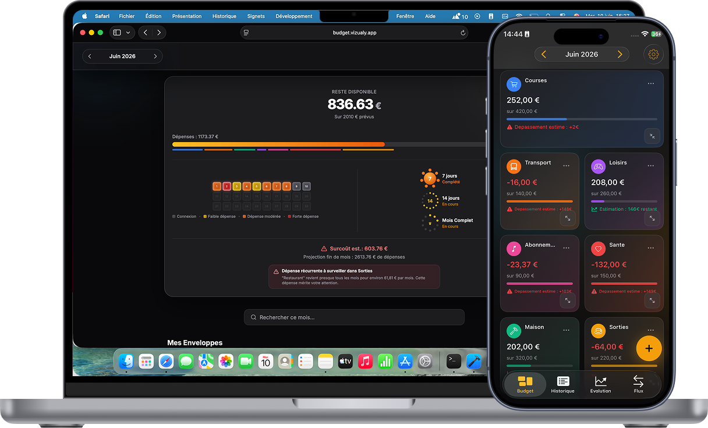
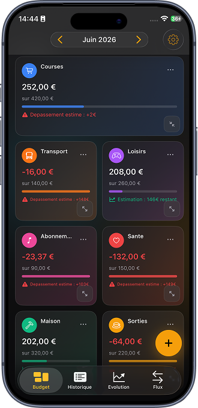
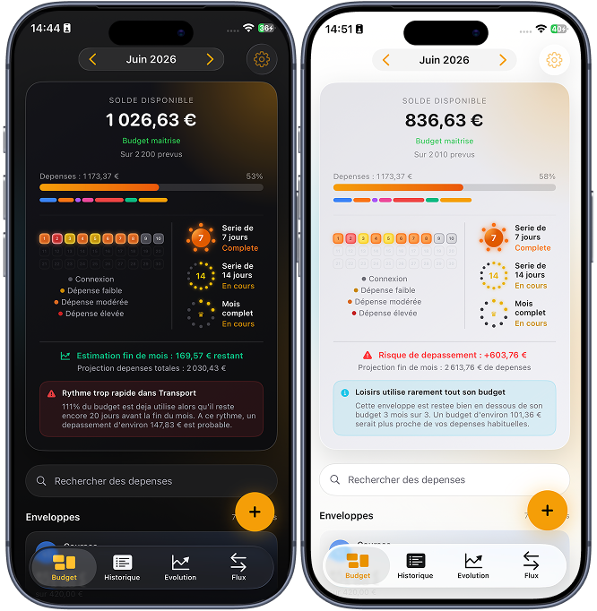
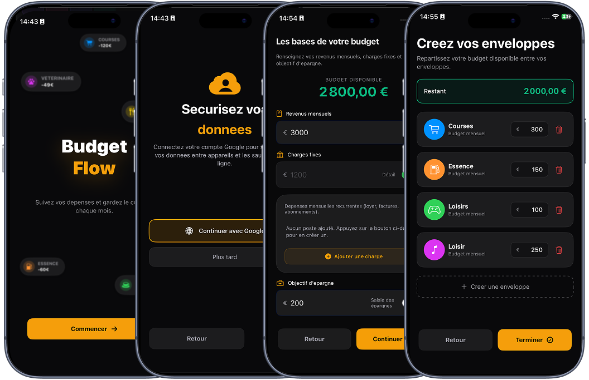
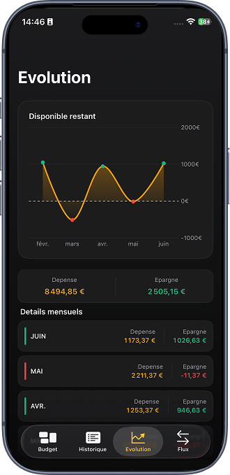
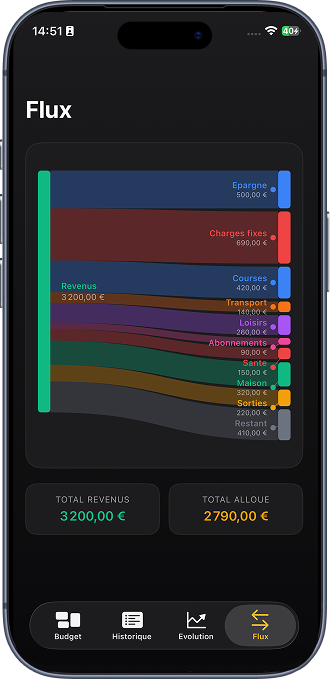

# BudgetFlow

> Maîtrisez votre budget mensuel grâce à la méthode des enveloppes. Simple, visuel et efficace.

**BudgetFlow** est une application multi-plateforme (Web + iOS native) conçue pour vous aider à reprendre le contrôle de vos finances personnelles. Basée sur la **méthode des enveloppes virtuelles**, elle vous permet d'allouer un budget précis à chaque catégorie de dépense et de suivre votre consommation en temps réel.

## Fonctionnalités

- **Gestion par Enveloppes** : Créez des catégories personnalisées (Courses, Loisirs, Shopping, etc.) et allouez-y un budget mensuel.
- **Enveloppes Temporaires** : Marquez une enveloppe comme temporaire et sélectionnez les mois actifs — elle disparaît automatiquement du dashboard les autres mois.
- **Dashboard Visuel** :
  - Vue d'ensemble avec solde disponible.
  - Barres de progression par enveloppe avec indicateur de dépassement.
  - Solde restant affiché en temps réel lors de la saisie d'une dépense.
  - Mise en page Bento Grid avec tailles de tuiles configurables (`small` / `wide`).
- **Thème clair / sombre** : Bascule adaptative sur Web et iOS, respectant les préférences système.
- **Mobile First** : Interface pensée pour l'usage quotidien sur smartphone.
- **Companion Apple Watch** :
  - Consultation rapide du restant du mois et des enveloppes principales.
  - Ajout rapide d'une dépense depuis la montre, relayée vers l'iPhone via `WatchConnectivityManager`.
- **Historique & Suivi** :
  - Historique global des transactions avec regroupement mensuel.
  - Vue détaillée par enveloppe.
  - Graphique d'évolution de l'épargne (avec cumul salaire).
  - Diagramme Cash Flow (Sankey).
- **Configuration complète** :
  - Revenus, charges fixes, épargne cible.
  - Indicateurs d'équilibre budgétaire.
- **Prévisions & Insights** :
  - Projection à 90 jours par enveloppe (score de confiance, alertes de dépassement prévisible).
  - Détection de dépenses exceptionnelles.
  - Disponible sur **Web et iOS** (`SpendingForecastEngine.swift`).
- **Parcours Fidélité (Gamification)** :
  - Grille heatmap d'activité mensuelle avec code couleur par intensité de dépense.
  - Badges jalons 7 jours, 14 jours et mois complet via un système SVG en anneau de points.
  - Tuile dashboard unifiée avec la carte "Reste disponible" (responsive, dégradés clair/sombre).
- **Widget iOS (WidgetKit)** : Solde disponible et enveloppe la plus dépensée sur l'écran d'accueil.
- **Retours haptiques iOS** : Vibrations distinctes à la confirmation et en cas d'alerte budgétaire.
- **Tests unitaires** : 16 suites · 200 tests · 94 % de couverture sur la logique métier Web (Jest) ; 25 fichiers XCTest sur iOS.

## Aperçu de l'interface

<p align="center">

### iOS

  
  
  
  
  
  

### Web

  
  
  
</p>

## Stack Technique

### Web App

- **Framework** : [Next.js 16](https://nextjs.org/) (App Router)
- **Langage** : [TypeScript](https://www.typescriptlang.org/) (mode strict)
- **Styles** : [Tailwind CSS](https://tailwindcss.com/) avec tokens sémantiques adaptatifs (clair/sombre)
- **Backend as a Service** : [Firebase](https://firebase.google.com/)
  - **Authentication** : Email/Password, Google Auth & Sign in with Apple
  - **Firestore** : Base de données NoSQL temps réel
  - **Cloud Messaging** : Notifications push
- **Icônes** : [Lucide React](https://lucide.dev/)
- **Graphiques** : [Recharts](https://recharts.org/) (Sankey Diagram)
- **Gestion de dates** : [date-fns](https://date-fns.org/)
- **Drag & Drop** : [@dnd-kit](https://dndkit.com/)
- **Tests** : [Jest](https://jestjs.io/) + [@testing-library/react](https://testing-library.com/) + [Playwright](https://playwright.dev/)

### iOS App

- **Framework** : SwiftUI
- **Stockage local** : SwiftData (offline-first)
- **Synchronisation** : Firebase Firestore (mode en ligne optionnel)
- **Charts** : Swift Charts (natif)
- **Icônes** : SF Symbols
- **Notifications** : UNUserNotificationCenter (notifications locales)
- **Companion watchOS** : app compagnon via WatchConnectivity
- **Tests** : XCTest

## Installation & Démarrage (Web)

### Prérequis

- Node.js (v18 ou supérieur)
- Un projet Firebase configuré (avec Auth et Firestore activés)

### 1. Cloner le projet

```bash
git clone https://github.com/votre-username/budget-flow.git
cd budget-flow
```

### 2. Installer les dépendances

```bash
npm install
```

### 3. Configuration des variables d'environnement

Créez un fichier `.env.local` à la racine du projet en copiant l'exemple :

```bash
cp .env.example .env.local
```

Remplissez ensuite les valeurs avec vos identifiants Firebase (disponibles dans la console Firebase > Project Settings) :

```env
NEXT_PUBLIC_FIREBASE_API_KEY=votre_api_key
NEXT_PUBLIC_FIREBASE_AUTH_DOMAIN=votre_project.firebaseapp.com
NEXT_PUBLIC_FIREBASE_PROJECT_ID=votre_project_id
NEXT_PUBLIC_FIREBASE_STORAGE_BUCKET=votre_project.appspot.com
NEXT_PUBLIC_FIREBASE_MESSAGING_SENDER_ID=votre_sender_id
NEXT_PUBLIC_FIREBASE_APP_ID=votre_app_id
```

### 4. Lancer le serveur de développement

```bash
npm run dev
```

L'application sera accessible sur `http://localhost:3000`.

## Tests

### Tests unitaires (Jest)

Voir [UnitTest.md](UnitTest.md) pour les instructions complètes.

```bash
npm test                    # Lancer les tests unitaires
npm run test:coverage       # Avec rapport de couverture
```

### Tests E2E (Playwright)

La suite complète couvre **58 tests** répartis sur 9 pages : flux public, onboarding, dashboard, enveloppes, transactions, paramètres, cashflow, évolution et historique.

Voir [playwrightWorkspace/playwrightReport.md](playwrightWorkspace/playwrightReport.md) pour le rapport détaillé.

```bash
npm run test:e2e:install    # Installer Chromium (une seule fois)
npm run test:e2e:auth       # Générer la session de test (une seule fois)
npm run test:e2e:new        # Lancer toute la suite E2E
npm run test:e2e:new:headed # Avec navigateur visible
```

Configuration requise dans `.env.local` :

```bash
NEXT_PUBLIC_E2E_AUTH_BYPASS=true
E2E_TEST_USER_UID=<uid_firebase>
E2E_ANCHOR_DATE=2026-06-01
```

Les résultats sont générés dans `playwrightWorkspace/` :
- `reports/` — rapport HTML
- `test-results/` — résultats JSON
- `traces/` / `screenshots/` / `videos/` — débogage

Pour les tests iOS : ouvrir le projet dans Xcode et appuyer sur **⌘U**.

## Déploiement en Production

### Déploiement sur Vercel (Recommandé)

1. **Connectez votre dépôt GitHub** à Vercel.
2. **Configurez les variables d'environnement** dans *Settings > Environment Variables*.
3. **Déployez** : Vercel détectera automatiquement Next.js.
4. **Configuration Firebase** : Ajoutez le domaine de production dans Firebase Console > Authentication > Authorized domains.

### Autres plateformes

- **Netlify** : Utilisez le plugin Next.js.
- **AWS Amplify** : Support natif de Next.js.
- **VPS/Docker** : `npm run build` puis `npm start`.

### Configuration Post-Déploiement

```bash
# Déployer les règles Firestore
firebase deploy --only firestore:rules
```

## Calcul de la couleur des cellules du calendrier

Chaque cellule du calendrier représente un jour passé. Sa couleur est déterminée par le **ratio** entre le total des dépenses du jour et le **budget mensuel total** (somme de tous les budgets d'enveloppes visibles).

| Condition | Couleur | Signification |
|---|---|---|
| Aucune dépense, connexion enregistrée | Gris | Connexion |
| `dépenses du jour / budget mensuel` ≤ 20 % | Jaune | Dépense faible |
| `dépenses du jour / budget mensuel` ≤ 50 % | Orange | Dépense modérée |
| `dépenses du jour / budget mensuel` > 50 % | Rouge | Dépense élevée |
| Aucune dépense, aucune connexion | Gris clair / vide | Jour inactif |
| Jour futur | Transparent | Non applicable |

**Exemple :**

- Budget mensuel total : 1 000 €
- Dépenses le 15 mai : 150 € → ratio = 15 % → 🟡 Jaune
- Dépenses le 20 mai : 350 € → ratio = 35 % → 🟠 Orange
- Dépenses le 25 mai : 600 € → ratio = 60 % → 🔴 Rouge

Le calcul est implémenté dans `src/lib/calendarSeverity.ts` (Web) et `iOS/BudgetFlowIOS/BudgetFlow/CalendarDaySeverity.swift` (iOS), et les deux restent strictement synchronisés.

## Notifications

Voir [NOTIFICATION.md](NOTIFICATION.md) pour la configuration de Firebase Cloud Messaging et des crons de notifications.

## Structure du Projet

```
src/
├── app/                      # Pages et Routing (Next.js App Router)
│   ├── (auth)/
│   │   └── login/page.tsx
│   ├── (protected)/          # Pages nécessitant authentification
│   │   ├── dashboard/        # Tableau de bord principal (bento grid)
│   │   ├── evolution/        # Graphique d'évolution des économies
│   │   ├── cashflow/         # Diagramme Sankey des flux financiers
│   │   ├── history/          # Historique global des transactions
│   │   ├── settings/         # Paramètres et gestion des enveloppes
│   │   ├── envelopes/[id]/   # Détail d'une enveloppe
│   │   └── onboarding/       # Configuration initiale
│   ├── api/
│   │   ├── notifications/trigger/  # Endpoint cron notifications
│   │   └── validate/transaction/   # Validation serveur
│   └── layout.tsx
├── components/
│   ├── ThemeToggle.tsx
│   ├── dashboard/
│   │   ├── CalendarHeatmap.tsx
│   │   ├── SearchDropdown.tsx
│   │   └── TransactionModal.tsx
│   └── settings/
│       └── TemporaryEnvelopeForm.tsx
├── context/
│   └── AuthContext.tsx
├── hooks/
│   ├── useCalendarHeatmap.ts
│   ├── useNotifications.ts
│   └── useSpendingForecast.ts
├── lib/
│   ├── firebase.ts           # Configuration Firebase Client
│   ├── firebaseAdmin.ts      # Configuration Firebase Admin (SSR)
│   ├── forecasting.ts        # Algorithme de projection 90 jours
│   ├── spendingInsights.ts   # Détection de dépenses exceptionnelles
│   ├── validation.ts         # Validateurs réutilisables
│   ├── logger.ts             # Logger sanitisé (prod/dev)
│   └── dateUtils.ts          # Utilitaires de dates
├── types/
│   └── envelope.ts           # Type Envelope + isEnvelopeActiveForMonth
└── __tests__/
    ├── app/                  # Tests API, dashboard, cashflow, login
    ├── components/           # Tests TransactionModal
    ├── hooks/                # Tests useSpendingForecast, useCalendarHeatmap
    ├── lib/                  # Tests validation, dateUtils, logger, forecasting…
    └── types/                # Tests isEnvelopeActiveForMonth

iOS/BudgetFlowIOS/
├── BudgetFlow/               # Code source Swift
│   ├── SpendingForecastEngine.swift   # Prévisions 90 jours (parité Web)
│   ├── SpendingInsightsEngine.swift   # Dépenses exceptionnelles
│   ├── HapticsManager.swift           # Retours haptiques
│   ├── WatchConnectivityManager.swift # Quick-add Apple Watch
│   ├── Localization.swift             # i18n FR/EN
│   ├── DesignSystem.swift    # Tokens de design adaptatifs (clair/sombre)
│   ├── Extensions.swift      # Extensions Color, Calendar
│   ├── NotificationService.swift
│   └── SyncService.swift     # Synchronisation Firestore
├── BudgetFlowWidgets/        # Widget WidgetKit
├── BudgetFlowAppleWatch Watch App/  # Companion watchOS
└── BudgetFlowTests/          # 25 fichiers XCTest
├── hooks/
│   └── useNotifications.ts
├── lib/
│   ├── firebase.ts           # Configuration Firebase Client
│   ├── firebaseAdmin.ts      # Configuration Firebase Admin (SSR)
│   ├── validation.ts         # Validateurs réutilisables
│   ├── logger.ts             # Logger sanitisé (prod/dev)
│   └── dateUtils.ts          # Utilitaires de dates
└── __tests__/
    └── lib/
        ├── validation.test.ts
        ├── dateUtils.test.ts
        └── logger.test.ts

iOS/BudgetFlow/
├── BudgetFlow/               # Code source Swift
│   ├── Models/               # Envelope, Transaction, UserSettings
│   ├── Views/                # Toutes les vues SwiftUI
│   ├── DesignSystem.swift    # Tokens de design adaptatifs (clair/sombre)
│   ├── Extensions.swift      # Extensions Color, Calendar
│   ├── NotificationService.swift
│   └── SyncService.swift     # Synchronisation Firestore
└── BudgetFlowTests/
    └── BudgetFlowTests.swift # Tests XCTest
```

## iOS App

L'application iOS native est **fonctionnelle** et disponible via le dossier `iOS/BudgetFlowIOS/` du projet.

### Fonctionnalités disponibles

- ✅ Toutes les fonctionnalités de base (enveloppes, transactions, historique, évolution, cash flow)
- ✅ Enveloppes temporaires avec filtrage automatique par mois
- ✅ Prévisions à 90 jours (`SpendingForecastEngine.swift`) — parité algorithmique avec le Web
- ✅ Détection de dépenses exceptionnelles (`SpendingInsightsEngine.swift`)
- ✅ Mode hors-ligne (SwiftData, aucune connexion requise)
- ✅ Mode en ligne avec synchronisation Firestore
- ✅ Authentification Firebase (`FirebaseManager` + `AuthView`)
- ✅ Thème clair / sombre adaptatif
- ✅ Notifications locales hebdomadaires
- ✅ Gestures natives (swipe-to-delete, drag & drop)
- ✅ Retours haptiques (`HapticsManager.swift`)
- ✅ Widget WidgetKit (écran d'accueil iOS)
- ✅ Companion Apple Watch avec quick-add relay
- ✅ Localisation FR/EN (`Localization.swift`)
- ✅ Accessibilité VoiceOver

## Sécurité

Voir [SECURITY.md](SECURITY.md) pour les détails des mesures de sécurité implémentées (règles Firestore, headers HTTP, validation, logs sanitisés).

## Licence

Distribué sous la licence MIT. Voir `LICENSE` pour plus d'informations.
